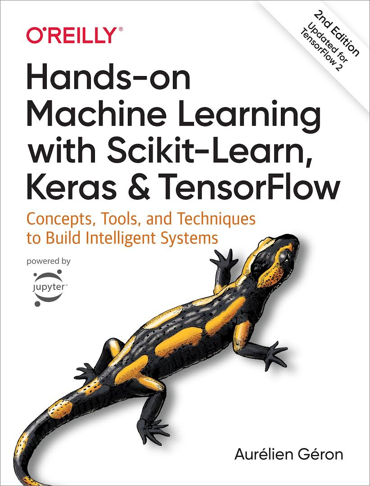

# Hands-On Machine Learning with Scikit-Learn, Keras, and TensorFlow

[Hands-On Machine Learning with Scikit-Learn, Keras, and TensorFlow](https://www.oreilly.com/library/view/hands-on-machine-learning/9781492032632/) 공부 및 예제 정리

## Contents

### [1. The Machine Learning Landscape](./ch1)
- What Is Machine Learning?
- Why Use Machine Learning?
- Types of Machine Learning Systems
- Main Challenges of Machine Learning
- Testing and Validating

### [2. End-to-End Machine Learning Project](./ch2)
- Working with Real Data
- Look at the Big Picture
- Get the Data
- Discover and Visualize the Data to Gain Insights
- Prepare the Data for Machine Learning Algorithms
- Select and Train a Model
- Fine-Tune Your Model

### [3. Classification](./ch3)
- MNIST
- Training a Binary Classifier
- Performace Measures
- Multiclass Classification
- Error Analysis
- Multilabel Classification
- Multioutput Classification

### [4. Training Models](./ch4)
- Linear Regression
- Gradient Descent
- Polynomial Regression
- Learning Curves
- Regularized Linear Models
- Logistic Regression

### [5.Support Vector Machines](./ch5)
- Linear SVM Classification